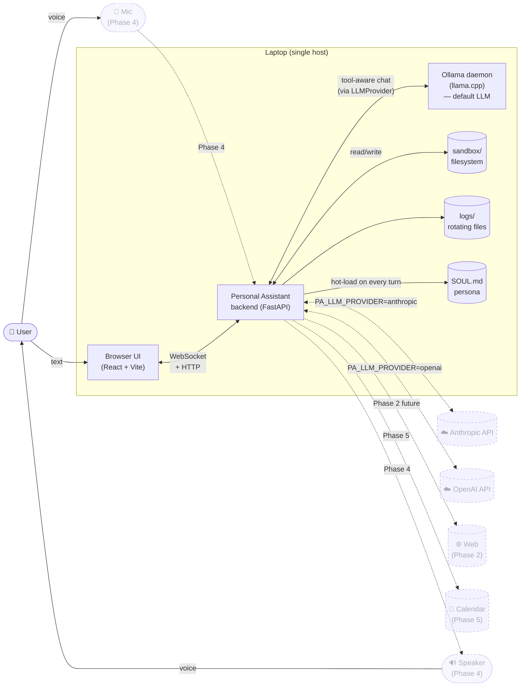
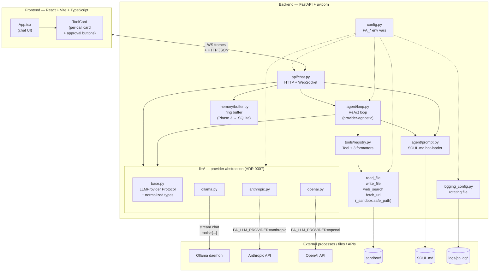
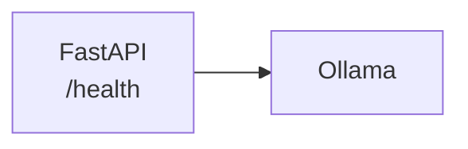
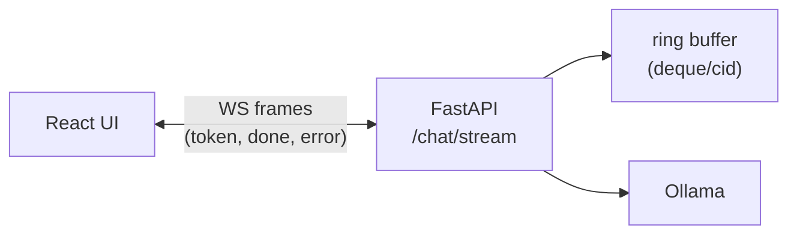
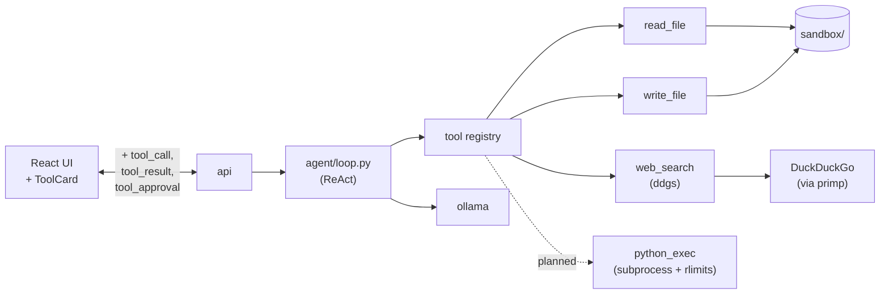
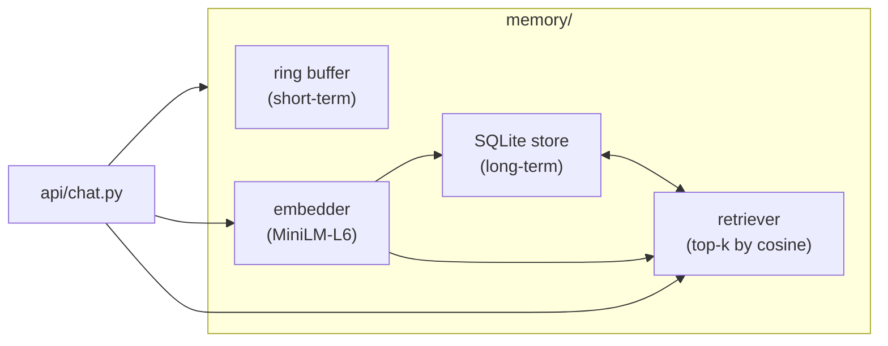
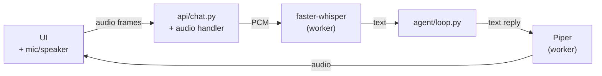
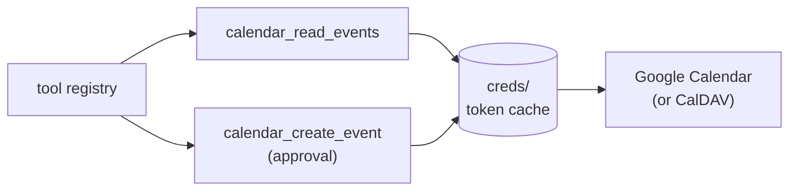
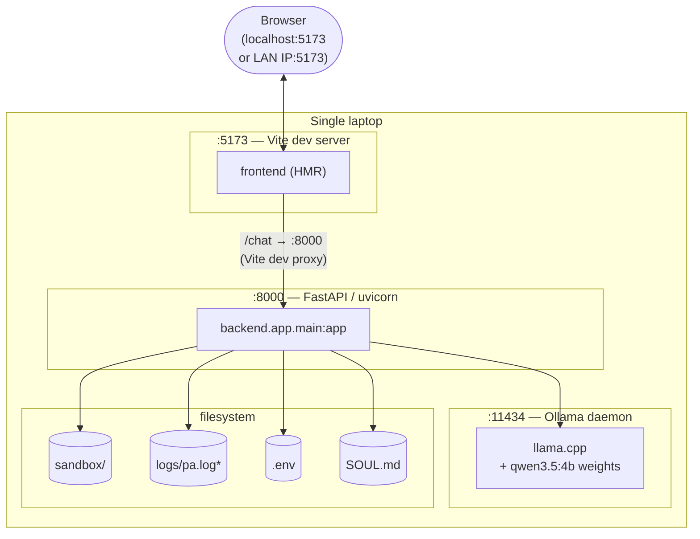

# High-Level Design

> A bird's-eye view of the personal assistant: what it is, what runs where, how the pieces talk, and how the architecture evolves through the seven planned phases. For module-level detail, jump to the [LLD](LLD.md).

## 1. Vision and non-goals

A **local-first agentic personal assistant**. Runs entirely on a single laptop (16 GB RAM target) using only open-source models. Accepts text or voice input, replies with text or speech. Has short-term and long-term memory. Calls tools (file I/O, web search, code execution, calendar). Eventually targets mobile.

It is also a **learning project**. Where reinventing has educational value (agent loop, tool dispatch, memory) we build from scratch; where it doesn't (LLM inference, ASR/STT, TTS) we reach for proven libraries.

**Non-goals**:

- Not a cloud product. No accounts, no multi-tenancy, no horizontal scaling.
- Not a multi-user system. One user, one laptop.
- Not a framework. The agent loop is hand-built — no LangChain, LangGraph, or smolagents. See [ADR 0001](../decisions/0001-tech-stack.md).
- Not adversary-proof. The sandbox prevents *accidental* damage from a misbehaving model; assumes the model is not deliberately malicious. See [ADR 0003 §5](../decisions/0003-agent-loop.md).

The vision document is [Project-Idea.md](../../Project-Idea.md). The persona injected into the LLM lives in [SOUL.md](../../SOUL.md).

## 2. System context

Who and what the assistant interacts with at the boundary.



Solid lines are wired today (end of Phase 2). Dashed lines are either planned or runtime-selectable (the cloud LLM backends are wired but disabled by default; see [ADR 0007](../decisions/0007-llm-provider-abstraction.md)).

## 3. Component view

The major components inside the laptop and how they're layered. Nothing here knows about the network beyond its immediate neighbour — every layer is replaceable.



## 4. Tech stack at a glance

| Concern | Choice | Why (one line) | ADR |
|---|---|---|---|
| LLM runtime | **Ollama** (wraps llama.cpp) | Single-binary install, easy model swaps, native tool-calling API | [0001](../decisions/0001-tech-stack.md) |
| Default model | **`qwen3.5:4b`** (fallback `llama3.2:latest`) | Small enough for CPU, supports tool-calling | [0001](../decisions/0001-tech-stack.md) |
| ASR/STT | **faster-whisper** (CTranslate2) | Best-in-class CPU latency for Whisper | [0001](../decisions/0001-tech-stack.md) |
| TTS | **Piper** | Tiny, fast, good-enough quality on CPU | [0001](../decisions/0001-tech-stack.md) |
| Backend | **FastAPI + uvicorn** | Native async, minimal boilerplate, first-class WebSocket | [0001](../decisions/0001-tech-stack.md) |
| Frontend | **React + Vite + TypeScript** | Fast HMR, broad mobile path later | [0001](../decisions/0001-tech-stack.md) |
| Short-term memory | **In-process ring buffer** (deque, maxlen=32) | Simplest thing that works for one user | [0001](../decisions/0001-tech-stack.md) |
| Long-term memory | **SQLite + sentence-transformers** (`all-MiniLM-L6-v2`) | No server, embeddings small enough to live in-process | [0001](../decisions/0001-tech-stack.md) |
| Agent loop | **Hand-built JSON tool-call protocol** — no framework | Learning goal; ~200 lines of clear code beats a framework | [0001](../decisions/0001-tech-stack.md) |
| Chat transport | **Long-lived WebSocket** with typed JSON frames | One handshake per session, multi-turn, easy to extend with new frame types | [0002](../decisions/0002-chat-transport.md) |
| Agent loop shape | **Native Ollama tool-calling, sequential ReAct** | Use the model's structured output, not prompt-and-parse; one tool at a time | [0003](../decisions/0003-agent-loop.md) |
| Streaming + tools | **Stream every iteration**; `tool_calls` finalise on the last chunk | Restores Phase 1's snappy UX without special-case branching | [0004](../decisions/0004-streaming-with-tools.md) |
| `web_search` backend | **`ddgs`** library (browser-fingerprinted DDG) | Raw HTML scrape gets bot-blocked; ddgs handles fingerprinting + endpoint rotation | [0005](../decisions/0005-search-backend-ddgs.md) |
| `fetch_url` tool | **`primp` + `trafilatura`**, approval-gated, public hosts only | Reuses primp from ddgs; trafilatura strips boilerplate; DNS pre-resolve rejects loopback/private | [0006](../decisions/0006-fetch-url-tool.md) |
| LLM provider abstraction | **Hand-rolled `LLMProvider` Protocol**, normalised types, adapters for Ollama / Anthropic / OpenAI | Switch backends at runtime; prerequisite for hosting on a cloud VPS later | [0007](../decisions/0007-llm-provider-abstraction.md) |
| Package manager | **uv** | Fast, single-binary, lockfile by default | [0001](../decisions/0001-tech-stack.md) |
| Python | **3.12** | Pattern matching, `typing.Self`, `Path.is_relative_to` | [0001](../decisions/0001-tech-stack.md) |

## 5. How a turn flows (three walkthroughs)

The three flows below are the three "shapes" of a turn the system can take today (a, b) and after Phase 3 (c). Sequence diagrams for each live in the [LLD's API + Agent loop sections](LLD.md#5-agent-loop).

**(a) Plain streaming chat — no tools**

1. UI sends `{conversation_id, message}` over the WebSocket.
2. Backend builds messages = `[system_prompt(), …history…, user_msg]` (as `LLMMessage` objects) and calls `provider.chat_stream(messages, tools=[...])`. The configured provider — Ollama by default, optionally Anthropic / OpenAI — handles its own SDK call.
3. Each non-empty content chunk is forwarded to the UI as a `token` frame.
4. The stream ends with no `tool_calls`. The accumulated text is the final reply.
5. Backend persists the user message + reply to the ring buffer and sends `done`.

**(b) Agent turn with a tool call (the canonical Phase 2 flow)**

1. Same as (a) up through the streaming call.
2. The stream ends *with* `tool_calls`. Backend appends an `assistant` message carrying those `tool_calls`.
3. For each tool call: send a `tool_call` frame to the UI; if the tool requires approval, send a `tool_approval` frame and block until the UI responds with `approval_response`.
4. Execute the tool, send a `tool_result` frame with a 500-char preview, append the *full* result as a `tool` message.
5. Loop back to step 2 with the extended message list. When the model produces no more `tool_calls`, the streamed text is the final reply.

**(c) Memory-augmented turn (Phase 3, planned)**

A retrieval step slots in between "build messages" and "call the provider": embed the user message, query SQLite for top-k relevant facts, prepend them as a system note. Everything downstream is unchanged. Sketch lives in [LLD §14](LLD.md#14-phase-3-long-term-memory-planned).

## 6. Cross-cutting concerns

### Configuration

All knobs are environment variables prefixed `PA_`, loaded by [pydantic-settings](https://docs.pydantic.dev/latest/concepts/pydantic_settings/) from the process environment or a `.env` at the repo root. Settings are read once at process start via an `@lru_cache` singleton — no hot reloads (except SOUL.md, see below). Full table in [LLD §11](LLD.md#11-configuration).

### Logging

Single rotating log file at `${PA_LOG_DIR}/pa.log` plus stderr. Daily rotation at midnight, 7-day retention. Uvicorn's HTTP/access loggers are **rerouted through our root logger** so all traffic ends up in the same file as application messages. Logger names follow the `pa.<component>` convention (`pa.main`, `pa.chat`, `pa.agent`).

### Sandboxing

File-touching tools resolve every user-supplied path through [`safe_path()`](../../backend/app/tools/_sandbox.py), which:

1. Refuses empty / whitespace-padded inputs.
2. Resolves the path relative to the sandbox root (`PA_AGENT_SANDBOX`, default `./sandbox`), collapsing `..` and following symlinks.
3. Verifies the final real path is still under the sandbox real path via `Path.is_relative_to()`.

This is **accidental-damage-proof, not adversary-proof** ([ADR 0003 §5](../decisions/0003-agent-loop.md)). A model that *tries* to escape (fork, etc.) is out of scope until Phase 6+.

### Personality (SOUL.md)

The system prompt is **not a code constant**. [`system_prompt()`](../../backend/app/agent/prompt.py) reads [SOUL.md](../../SOUL.md) from disk on every turn. Persona edits are hot — no server restart needed. The cost is one small file read per turn; the benefit is rapid iteration on voice and values.

### Approval gating

Each `Tool` carries a `requires_approval: bool`. When set, the loop pauses, sends a `tool_approval` frame to the UI, and blocks on the matching `approval_response`. The UI renders inline Approve/Deny buttons on the tool card. Auto-approve is available via `PA_AGENT_AUTO_APPROVE=true` for headless smoke runs.

### LLM provider selection

The agent loop and chat endpoint talk to an `LLMProvider` ([backend/app/llm/base.py](../../backend/app/llm/base.py)) — a small Protocol with one method, `chat_stream(messages, tools) → AsyncIterator[LLMChunk]`. `PA_LLM_PROVIDER` picks the concrete adapter at startup: `ollama` (default, local-first), `anthropic` (cloud, content-block tool protocol), or `openai` (cloud, function tools). Provider-specific knobs (`PA_OLLAMA_THINK` / `_NUM_CTX`, `PA_ANTHROPIC_MAX_TOKENS`, etc.) live inside their respective adapters; only their selected adapter reads them. See [ADR 0007](../decisions/0007-llm-provider-abstraction.md) for the design rationale and [LLD §7](LLD.md#7-llm-providers) for the per-provider translation details.

## 7. Phased evolution

Each phase ends with a working, demoable system. For each phase below: the architectural **delta** (what gets added or replaced), not the whole picture.

### Phase 0 — Foundations · ✅ **Done**

Backend skeleton, `/health`, Ollama smoke test, docs scaffold. Nothing user-facing yet.



### Phase 1 — Text-only chat MVP · ✅ **Done**

`POST /chat` (HTTP) and `WS /chat/stream` for streaming, the React UI, and the ring-buffer memory.



ADR [0002](../decisions/0002-chat-transport.md) shipped here (WebSocket + JSON frame protocol).

### Phase 2 — Agent loop + tools · ✅ **Done** (file tools, web_search); 🔄 **In progress** (python_exec)

Sequential ReAct loop, `read_file`, `write_file`, `web_search`, sandbox, approval flow, streaming on every iteration. The frame protocol gains `tool_call`, `tool_result`, `tool_approval`, and `approval_response`. ADRs [0003](../decisions/0003-agent-loop.md), [0004](../decisions/0004-streaming-with-tools.md), and [0005](../decisions/0005-search-backend-ddgs.md) shipped here.



### Phase 3 — Long-term memory · ⏭ **Planned**

SQLite + `sentence-transformers` (`all-MiniLM-L6-v2`). Auto-extracted facts during a turn; top-k retrieval prepended to the system prompt on the next turn. The ring buffer stays — it's still the source of truth for "the last few exchanges."



### Phase 4 — Voice I/O · ⏭ **Planned**

Mic capture in the browser, audio frames over the WebSocket, [faster-whisper](https://github.com/SYSTRAN/faster-whisper) for ASR, [Piper](https://github.com/rhasspy/piper) for TTS. The agent loop is unchanged; voice is a transport-level concern. Likely a separate worker process so model loads don't block the FastAPI event loop.



### Phase 5 — Calendar + richer tools · ⏭ **Planned**

`calendar_*` tools (read events, create, modify) plus richer integrations. No structural change beyond new tool entries in `TOOLS` and an OAuth/credentials handling helper. Approval-gated by default for write actions.



### Phase 6 — Hot-path C/C++ · ⏭ **Planned**

Profile after Phase 4. Likely candidates for FFI replacement: the embedder's tokenisation/normalisation step, possibly the sandbox path checks if they're hot. Use `ctypes`/`cffi`/`pybind11` at well-defined seams; pure-Python fallback stays.

### Phase 7 — Mobile · ⏭ **Planned**

Open question. The three candidates and their architectural implications:

- **React Native** — reuse most of the React component layer; backend likely runs on the laptop with the phone as a thin client over LAN. Easy if backend stays a server.
- **Native Android** — best mobile UX, biggest rewrite. Backend stays separate; phone talks WS.
- **PWA** — fastest path; works on any phone with a browser. Limits voice and background tasks.

The decision affects whether the backend becomes "always-on at home, phone is a client" or whether parts of the stack move on-device. Out of scope until everything else is in place.

## 8. Deployment topology

Today: three processes on a single laptop.



The Vite dev proxy ([frontend/vite.config.ts](../../frontend/vite.config.ts)) forwards `/chat` (with `ws: true`) and `/health` to FastAPI on `:8000`, which means the browser sees same-origin requests and CORS preflights are skipped in dev. Production would serve the built `dist/` from FastAPI on a single port.

LAN access from a phone is supported (Vite + uvicorn bind `0.0.0.0`), with notes on WSL2 networking captured in [docs/learnings/frontend.md](../learnings/frontend.md).

In **Phase 4**, expect to add an audio-worker process (faster-whisper / Piper) so model loads don't stall the FastAPI event loop. In **Phase 7**, the topology splits across two devices.

## 9. Repo layout (skeleton)

```
personal_assistant/
├── backend/app/
│   ├── api/chat.py                # HTTP + WebSocket
│   ├── agent/{loop,prompt}.py     # ReAct loop + SOUL.md loader
│   ├── llm/                       # LLMProvider abstraction (ADR 0007)
│   │   ├── base.py                #   Protocol + normalized types
│   │   ├── ollama.py              #   default; wraps ollama.AsyncClient
│   │   ├── anthropic.py           #   cloud; Messages API content blocks
│   │   └── openai.py              #   cloud; Chat Completions streaming
│   ├── tools/                     # registry + read_file / write_file / web_search / fetch_url + _sandbox
│   ├── memory/buffer.py           # in-process ring buffer
│   ├── config.py                  # pydantic-settings
│   ├── logging_config.py          # rotating file logger
│   └── main.py                    # FastAPI entry, /health, CORS, router mount
├── frontend/                      # React + Vite + TS chat UI
├── sandbox/                       # gitignored; agent's read/write scope
├── logs/                          # gitignored; rotating logs
├── scripts/                       # smoke_ollama, smoke_provider, smoke_chat_ws*, smoke_agent
├── docs/
│   ├── decisions/                 # ADRs (immutable)
│   ├── design/                    # this folder (living)
│   ├── learnings/                 # topic notes
│   └── sessions/                  # one per working session
├── CLAUDE.md                      # state for future Claude sessions
├── SOUL.md                        # assistant persona (hot-loaded)
└── Project-Idea.md                # vision
```

Future phases will add `backend/app/audio/` (Phase 4), `backend/app/memory/store.py` (Phase 3), and `backend/app/integrations/` for calendar (Phase 5).

## 10. Where to go next

- Implementation detail of any of the components above → [LLD.md](LLD.md).
- The reasoning behind a specific choice → the linked ADR.
- Lessons we learned the hard way → [docs/learnings/](../learnings/).
- What we did when → [docs/sessions/](../sessions/).
