# Low-Level Design

> Module-by-module reference for the personal assistant. Each section has: responsibilities → public API → key data structures → diagrams → `file:line` anchors. For the bird's-eye view, see [HLD](HLD.md).

## Table of contents

1. [Process and module map](#1-process-and-module-map)
2. [Data structures shared across modules](#2-data-structures-shared-across-modules)
3. [API layer — HTTP and WebSocket](#3-api-layer--http-and-websocket)
4. [Frame protocol (WebSocket)](#4-frame-protocol-websocket)
5. [Agent loop](#5-agent-loop)
6. [Tool registry](#6-tool-registry)
7. [LLM providers](#7-llm-providers)
8. [Tools and sandbox](#8-tools-and-sandbox)
9. [Memory — short-term ring buffer](#9-memory--short-term-ring-buffer)
10. [Prompt assembly](#10-prompt-assembly)
11. [Configuration](#11-configuration)
12. [Logging](#12-logging)
13. [Frontend](#13-frontend)
14. [Phase 3 — long-term memory (planned)](#14-phase-3-long-term-memory-planned)
15. [Phase 4 — voice I/O (planned)](#15-phase-4-voice-io-planned)
16. [Phase 5 — calendar tools (planned)](#16-phase-5-calendar-tools-planned)
17. [Phase 6 — hot paths (planned)](#17-phase-6-hot-paths-planned)
18. [Phase 7 — mobile (planned)](#18-phase-7-mobile-planned)

---

## 1. Process and module map

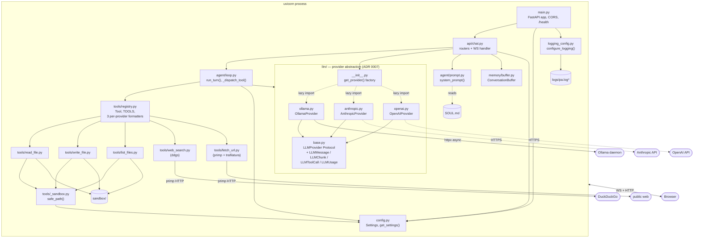

The whole backend is a single uvicorn process. All singletons (`get_settings()`, `_provider()`, `buffer`) live for the process lifetime. The cloud-provider edges are dashed because only one adapter is active per process — picked by `PA_LLM_PROVIDER` at startup, with the other adapters' SDKs imported lazily inside `get_provider()`.

---

## 2. Data structures shared across modules

These few small types flow between layers. Keeping them here avoids duplicating the definitions in every section that touches them.

| Type | Location | Shape | Notes |
|---|---|---|---|
| `Message` | [memory/buffer.py:8](../../backend/app/memory/buffer.py#L8) | `dataclass(frozen=True)` with `role: Literal["user","assistant"]`, `content: str` | Buffer's persistence type — different from `LLMMessage` (below), which is the loop's working type |
| `Role` | [memory/buffer.py:5](../../backend/app/memory/buffer.py#L5) | `Literal["user", "assistant"]` | Tool messages use the raw `"tool"` string in the loop, not this alias |
| `LLMMessage` | [llm/base.py](../../backend/app/llm/base.py) | `dataclass`: `role: Literal["system","user","assistant","tool"]`, `content`, optional `tool_calls`, optional `tool_call_id` | The working type passed through the loop and into providers; provider adapters translate to their SDK's native shape |
| `LLMToolCall` | [llm/base.py](../../backend/app/llm/base.py) | `dataclass`: `id, name, arguments` | `id` is end-to-end so cloud providers can correlate `tool_use` ↔ `tool_result`; Ollama adapter synthesizes `tc_<n>` |
| `LLMUsage` | [llm/base.py](../../backend/app/llm/base.py) | `dataclass`: `prompt_tokens`, `completion_tokens`, `duration_ns` | Cloud adapters approximate `duration_ns` with wall-clock; Ollama reports true decode time |
| `LLMChunk` | [llm/base.py](../../backend/app/llm/base.py) | `dataclass`: `delta_text`, `tool_calls`, `done`, `usage` | Yielded by `chat_stream`. Tool calls only on the final chunk, fully assembled. Usage only when `done=True` |
| `LLMProvider` | [llm/base.py](../../backend/app/llm/base.py) | `typing.Protocol` with one method: `chat_stream(messages, tools) → AsyncIterator[LLMChunk]` | Adapters are duck-typed; no inheritance |
| `Tool` | [tools/registry.py](../../backend/app/tools/registry.py) | `dataclass(frozen=True)`: `name`, `description`, `parameters`, `fn`, `requires_approval` | `parameters` is the inner JSON Schema (no provider envelope); per-provider formatters wrap it |
| `ChatRequest` | [api/chat.py](../../backend/app/api/chat.py) | Pydantic: `conversation_id: str (min_length=1)`, `message: str (min_length=1)` | Reused by both HTTP and WS endpoints |
| `ChatResponse` | [api/chat.py](../../backend/app/api/chat.py) | Pydantic: `conversation_id`, `reply` | HTTP only |
| `ResetRequest` / `ResetResponse` | [api/chat.py](../../backend/app/api/chat.py) | Pydantic | Used by `POST /chat/reset` |
| `Settings` | [config.py](../../backend/app/config.py) | `pydantic-settings` BaseSettings, env prefix `PA_`, reads `.env` | Singleton via `@lru_cache get_settings()` |
| `OnEvent` | [agent/loop.py](../../backend/app/agent/loop.py) | `Callable[[dict[str, Any]], Awaitable[None]]` | Push-only callback for emitting frames |
| `RequestApproval` | [agent/loop.py](../../backend/app/agent/loop.py) | `Callable[[str, str, dict[str, Any]], Awaitable[bool]]` | Pull callback: `(call_id, name, args) → approved` |
| `AgentError` | [agent/loop.py](../../backend/app/agent/loop.py) | Exception | Loop couldn't produce an answer (max steps, repeated tool errors) |
| `SandboxError` | [tools/_sandbox.py](../../backend/app/tools/_sandbox.py) | `ValueError` subclass | Path argument escaped the sandbox |
| `ToolError` | [tools/registry.py](../../backend/app/tools/registry.py) | Exception | Defined but currently unused; tools return error strings, not exceptions |

```mermaid
classDiagram
    class Message {
        <<frozen dataclass>>
        +role: Role
        +content: str
    }
    class LLMMessage {
        <<dataclass>>
        +role: Literal[system,user,assistant,tool]
        +content: str
        +tool_calls: list[LLMToolCall] | None
        +tool_call_id: str | None
    }
    class LLMToolCall {
        <<dataclass>>
        +id: str
        +name: str
        +arguments: dict
    }
    class LLMChunk {
        <<dataclass>>
        +delta_text: str | None
        +tool_calls: list[LLMToolCall] | None
        +done: bool
        +usage: LLMUsage | None
    }
    class LLMUsage {
        <<dataclass>>
        +prompt_tokens: int
        +completion_tokens: int
        +duration_ns: int | None
    }
    class LLMProvider {
        <<Protocol>>
        +chat_stream(messages, tools) AsyncIterator~LLMChunk~
    }
    class Tool {
        <<frozen dataclass>>
        +name: str
        +description: str
        +parameters: dict
        +fn: async (...) -> str
        +requires_approval: bool
    }
    class ConversationBuffer {
        -_maxlen: int
        -_convos: dict[str, deque[Message]]
        +append(cid, message)
        +history(cid) list[Message]
        +clear(cid)
    }
    LLMMessage --> LLMToolCall : assistant turns carry calls;<br/>tool turns carry an id
    LLMChunk --> LLMToolCall : final chunk surfaces<br/>assembled calls
    LLMChunk --> LLMUsage : final chunk carries usage
    LLMProvider ..> LLMChunk : yields
    LLMProvider ..> LLMMessage : consumes
    LLMProvider ..> Tool : consumes
    ConversationBuffer "1" *-- "*" Message : stores
```

A note on the two message types: `Message` (in `memory/buffer.py`) is the **persistence** shape — what we store between turns. `LLMMessage` (in `llm/base.py`) is the **working** shape — what the loop manipulates inside a turn (assistant turns with tool_calls, role="tool" results with `tool_call_id`). The chat endpoint translates persisted `Message`s into `LLMMessage`s when building each turn's base messages.

---

## 3. API layer — HTTP and WebSocket

**File**: [backend/app/api/chat.py](../../backend/app/api/chat.py) · **Logger**: `pa.chat`

### Responsibilities

- Accept HTTP requests for non-streaming chat and conversation reset.
- Hold the long-lived WebSocket and drive one agent turn per inbound message.
- Construct the message list passed to the loop (system prompt + history + new turn) as `LLMMessage` objects.
- Persist completed turns to the conversation buffer.
- Manage the lazy singleton `LLMProvider` ([`_provider()`](../../backend/app/api/chat.py)) — concrete adapter chosen by `PA_LLM_PROVIDER`.

### Endpoints

| Method | Path | Request | Response | Use |
|---|---|---|---|---|
| `POST` | `/chat` | `ChatRequest` | `ChatResponse` | Non-streaming. Routes through `run_turn` with no-op callbacks; approvals auto-denied (the HTTP path can't prompt the user). |
| `POST` | `/chat/reset` | `ResetRequest` | `ResetResponse` | Drop a conversation from the buffer. |
| `WS` | `/chat/stream` | (frames) | (frames) | The main entry point. |
| `GET` | `/health` | — | `{status, ollama_host, ollama_model}` | [main.py](../../backend/app/main.py) |

### `_build_messages()` and `_persist_turn()`

Two tiny helpers used by both the HTTP and WS handlers. [`_build_messages`](../../backend/app/api/chat.py) prepends `LLMMessage(role="system", content=system_prompt())` (re-read fresh — see [§10](#10-prompt-assembly)), spreads the history out as `LLMMessage` objects, and appends the new user turn. [`_persist_turn`](../../backend/app/api/chat.py) appends the user message *and* the assistant reply to the buffer in one go (still using the lighter `Message` type from `memory/buffer.py`).

### `_provider()`

A lazy `@lru_cache` singleton over [`get_provider()`](../../backend/app/llm/__init__.py) so the same adapter instance is reused for the process lifetime. The factory dispatches on `PA_LLM_PROVIDER` and imports the chosen adapter lazily — the unused SDKs never run their import-time code.

Provider-specific options (Ollama's `num_ctx` / `num_gpu` / `think`, Anthropic's `max_tokens`, OpenAI's `stream_options`) are read inside the adapter, **not** in the chat handler. The handler only knows about `LLMMessage` and `Tool`. See [§7](#7-llm-providers) for the per-adapter translation details and [§11](#11-configuration) for the env-var matrix.

### WebSocket connection state

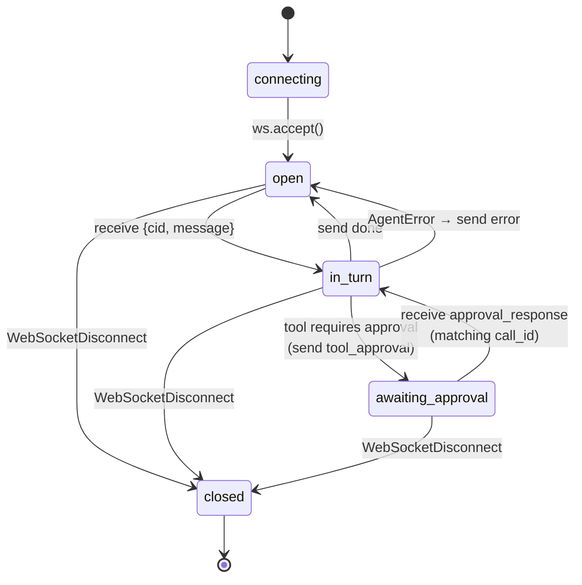

While in `awaiting_approval`, any frame whose `type ≠ "approval_response"` or whose `call_id` doesn't match is logged and discarded ([chat.py:154-163](../../backend/app/api/chat.py#L154-L163)). The UI disables the composer while a turn is in flight, so this discard branch is defensive.

### Callback wiring (`on_event`, `request_approval`)

The WS handler defines two closures per turn ([chat.py:139-163](../../backend/app/api/chat.py#L139-L163)) and passes them into the agent loop. The loop knows nothing about WebSockets — it just calls the callbacks. This makes `run_turn()` trivially testable with plain async fakes; see [docs/learnings/agent-loop-architecture.md](../learnings/agent-loop-architecture.md).

```python
async def on_event(frame: dict) -> None:
    await ws.send_json({**frame, "conversation_id": req.conversation_id})

async def request_approval(call_id: str, name: str, args: dict) -> bool:
    await ws.send_json({"type": "tool_approval", ...})
    while True:
        frame = await ws.receive_json()
        if frame.get("type") == "approval_response" and frame.get("call_id") == call_id:
            return bool(frame.get("approved"))
        log.warning("ws unexpected frame during approval: %s", frame.get("type"))
```

---

## 4. Frame protocol (WebSocket)

The complete contract for `WS /chat/stream`. Defined in code at [chat.py:106-120](../../backend/app/api/chat.py#L106-L120); duplicated here in tabular form.

### Server → Client

| `type` | Required fields | Sent when | Example |
|---|---|---|---|
| `token` | `delta: str` | Each non-empty content chunk from the stream | `{"type":"token","delta":"Hello","conversation_id":"c-…"}` |
| `tool_call` | `call_id, name, args` | Loop is about to dispatch a tool | `{"type":"tool_call","call_id":"call_a1b2c3","name":"read_file","args":{"path":"notes.txt"},"conversation_id":"c-…"}` |
| `tool_approval` | `call_id, name, args` | Tool needs user approval (`requires_approval=True` and not auto-approve) | `{"type":"tool_approval","call_id":"call_…","name":"write_file","args":{…},"conversation_id":"c-…"}` |
| `tool_result` | `call_id, ok: bool, preview: str` | Tool finished (success, error, or denial); `preview` is ≤500 chars of the full result | `{"type":"tool_result","call_id":"call_…","ok":true,"preview":"hello\n","conversation_id":"c-…"}` |
| `done` | — | Turn completed successfully | `{"type":"done","conversation_id":"c-…"}` |
| `error` | `error: str` | Loop raised `AgentError` or an unhandled exception | `{"type":"error","error":"agent exceeded MAX_STEPS=8…","conversation_id":"c-…"}` |

Every server frame carries `conversation_id` — added by `on_event` in the spread `{**frame, "conversation_id": …}` ([chat.py:140](../../backend/app/api/chat.py#L140)).

### Client → Server

| `type` (or shape) | Fields | Sent when |
|---|---|---|
| (turn start, no `type` field) | `conversation_id, message` | User submits the composer |
| `approval_response` | `call_id, approved: bool` | User clicks Approve or Deny on a tool card |

### Versioning strategy

Per ADR [0002](../decisions/0002-chat-transport.md) §"Versioning": the discriminated-union shape lets us add new `type` values without breaking old clients. A client that doesn't recognise a frame type can ignore it (today's UI [App.tsx:126](../../frontend/src/App.tsx#L126) silently drops unknown types). New required fields on existing types are a breaking change and must coordinate UI + backend.

---

## 5. Agent loop

**File**: [backend/app/agent/loop.py](../../backend/app/agent/loop.py) · **ADRs**: [0003](../decisions/0003-agent-loop.md), [0004](../decisions/0004-streaming-with-tools.md) · **Logger**: `pa.agent`

### Responsibilities

- Drive a single user turn to a final answer.
- Stream content tokens out as they arrive (every iteration).
- Dispatch `tool_calls` sequentially, gating with approval where required.
- Cap iteration count and retry-per-tool failures so a stuck loop fails loudly.

### `run_turn()` — the algorithm

Pseudocode (real implementation at [loop.py](../../backend/app/agent/loop.py)):

```python
msgs: list[LLMMessage] = list(base_messages)
tools = list(TOOLS.values())
consecutive_errors, last_failed_tool = 0, None

for step in range(MAX_STEPS):
    content_chunks, final_tool_calls, usage = [], [], None

    async for chunk in provider.chat_stream(msgs, tools):
        if chunk.delta_text:
            content_chunks.append(chunk.delta_text)
            await on_event({"type": "token", "delta": chunk.delta_text})
        if chunk.done:
            if chunk.tool_calls:
                final_tool_calls = chunk.tool_calls
            usage = chunk.usage

    # Aggregate stats across iterations
    if usage is not None:
        total_eval_tokens   += usage.completion_tokens
        total_prompt_tokens += usage.prompt_tokens
        total_eval_ns       += usage.duration_ns or 0
        model_calls += 1

    content = "".join(content_chunks)
    if not final_tool_calls:
        return content, _make_stats(...)                          # done

    msgs.append(LLMMessage(role="assistant", content=content,
                           tool_calls=final_tool_calls))

    for tc in final_tool_calls:
        call_id = f"call_{uuid.uuid4().hex[:12]}"
        await on_event({"type": "tool_call", "call_id": call_id,
                        "name": tc.name, "args": tc.arguments})
        ok, result = await _dispatch_tool(tc.name, tc.arguments,
                                          call_id=call_id, request_approval=…)
        await on_event({"type": "tool_result", "call_id": call_id, "ok": ok,
                        "preview": _preview(result)})
        if ok:
            consecutive_errors, last_failed_tool = 0, None
        else:
            consecutive_errors = consecutive_errors + 1 if last_failed_tool == tc.name else 1
            last_failed_tool = tc.name
            if consecutive_errors > MAX_RETRIES_PER_TOOL:
                raise AgentError(...)
        # tc.id threads back via tool_call_id so Anthropic/OpenAI can correlate;
        # Ollama ignores it (its wire format doesn't use ids).
        msgs.append(LLMMessage(role="tool", content=result, tool_call_id=tc.id))

raise AgentError(f"exceeded MAX_STEPS={MAX_STEPS}")
```

A few details worth knowing before changing this:

- **Provider-agnostic.** The loop reads `chunk.delta_text` / `chunk.tool_calls` / `chunk.usage` — never anything Ollama-specific. The Ollama, Anthropic, and OpenAI adapters all yield `LLMChunk` with the same invariants (see [§7](#7-llm-providers)).
- **Streaming is unconditional.** Even with `tools=[…]` available, we stream and forward tokens. `tool_calls` arrive complete on the final chunk (the adapter's job — see [docs/learnings/streaming-with-tools.md](../learnings/streaming-with-tools.md)). The loop simply reads `chunk.tool_calls` when `chunk.done is True`.
- **`tool_call_id` threads end-to-end.** Each `LLMToolCall` has an `id`. When the loop builds the tool-result message it sets `tool_call_id=tc.id`. Anthropic and OpenAI require this for correlation; Ollama ignores it.
- **Model sees full results, UI sees previews.** The `preview` field on `tool_result` is truncated by `_preview(text, n=500)`; the full text goes back to the model in the next `LLMMessage(role="tool", content=result)`.
- **Retries are per-tool.** A different tool's failure resets the counter.
- **Approval denial is not an error.** `_dispatch_tool` returns `(ok=True, "User denied this action.")` so the model can adapt without burning a retry slot.

### `_dispatch_tool()` decision table

| Condition | Returned `(ok, body)` | Counter effect |
|---|---|---|
| `name not in TOOLS` | `(False, "unknown tool: 'x'. available: [...]")` | Increments (or starts a new streak) |
| `requires_approval` and not auto-approve, user denies | `(True, "User denied this action.")` | Resets |
| Tool raises `TypeError` (bad/missing kwargs) | `(False, "argument error: <msg>")` | Increments |
| Tool raises any other exception | `(False, "<ExcClass>: <msg>")` | Increments |
| Tool returns non-string | `(True, str(result))` | Resets |
| Tool returns string | `(True, result)` | Resets |

### Sequence diagrams

**(a) Plain streaming chat — no tools fired**

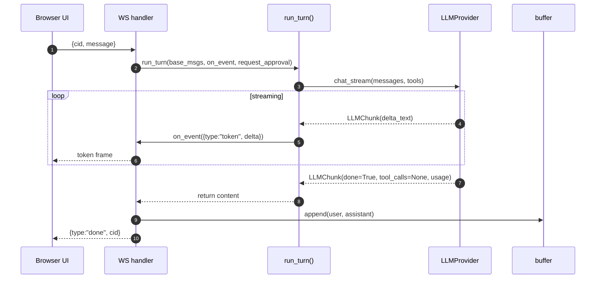

**(b) Tool turn with approval — the canonical Phase 2 flow**

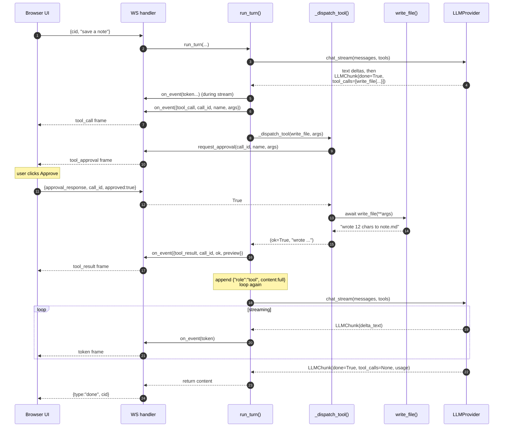

**(c) Tool error + retry, then fail-out**

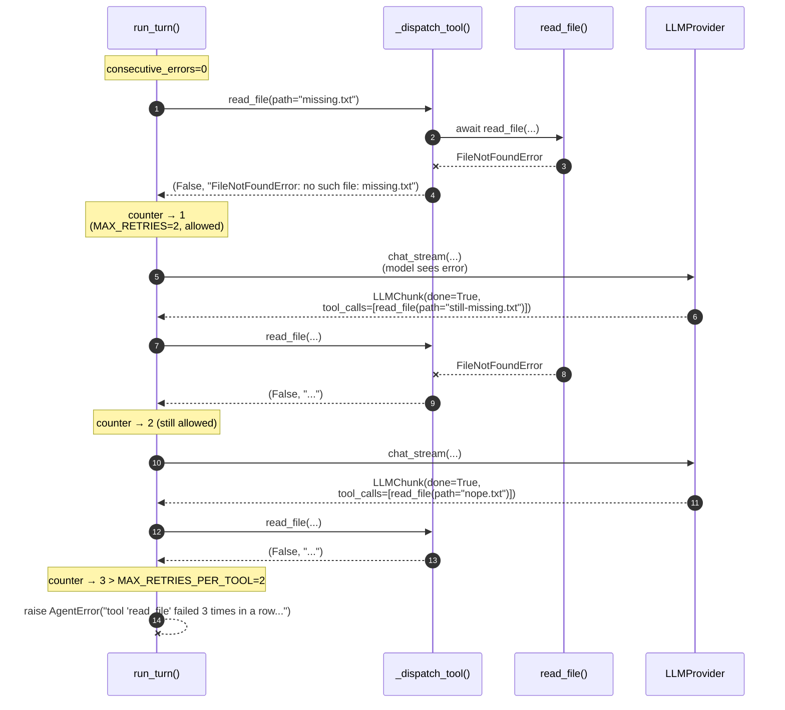

**(d) Approval denied — not counted as an error**

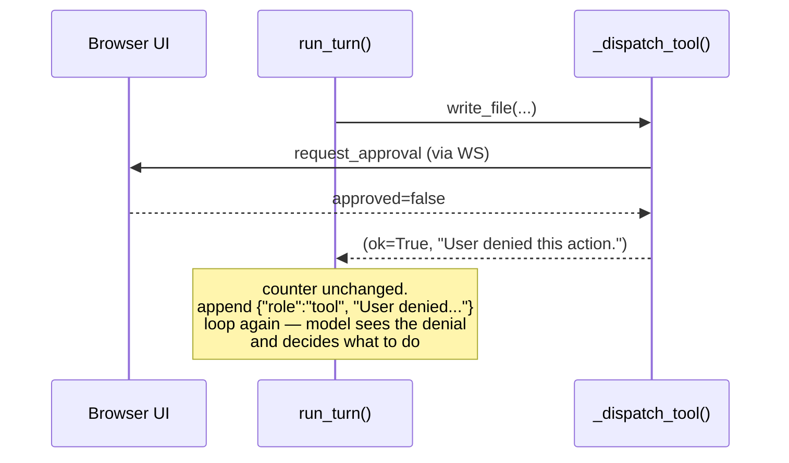

---

## 6. Tool registry

**File**: [backend/app/tools/registry.py](../../backend/app/tools/registry.py) · **ADRs**: [0003 §3](../decisions/0003-agent-loop.md), [0007](../decisions/0007-llm-provider-abstraction.md)

A dict, not a framework. The registry holds canonical `Tool` records and exposes three per-provider formatters that wrap the canonical JSON Schema in whichever envelope the provider expects.

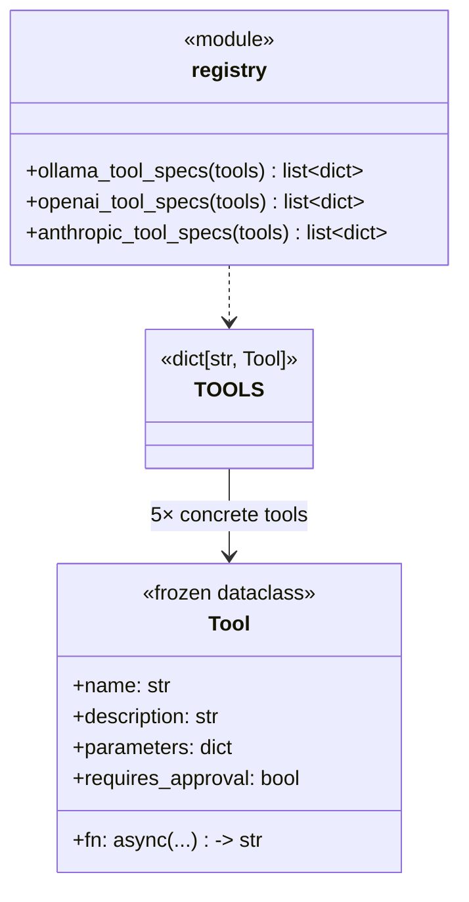

Each tool module ([read_file.py](../../backend/app/tools/read_file.py) etc.) exposes three module-level constants — `NAME`, `DESCRIPTION`, `PARAMETERS` (the inner JSON Schema) — plus the async `fn`. The registry's `_make()` helper builds a `Tool` from those.

### Per-provider formatters

| Function | Envelope shape |
|---|---|
| `ollama_tool_specs(tools)` | `{"type": "function", "function": {"name", "description", "parameters"}}` |
| `openai_tool_specs(tools)` | Wire-identical to Ollama's (separate function so the two can drift later) |
| `anthropic_tool_specs(tools)` | `{"name", "description", "input_schema"}` (Anthropic's flatter shape) |

The agent loop hands the canonical `list[Tool]` straight to `provider.chat_stream(...)`; the adapter calls its own formatter internally. Loop code never sees the wrapped shapes.

### Adding a tool

Three steps, no decorators:

1. Create `backend/app/tools/<your_tool>.py` with an async `fn(**kwargs) -> str` and three module-level constants: `NAME: str`, `DESCRIPTION: str`, `PARAMETERS: dict` (the inner JSON Schema — `{"type": "object", "properties": ..., "required": [...]}`). Use [read_file.py](../../backend/app/tools/read_file.py) as the template.
2. Import the module in [registry.py](../../backend/app/tools/registry.py) and add an entry to `TOOLS` via the `_make()` helper with the right `requires_approval`.
3. (Optional) Add a smoke test in `scripts/`.

That's it. All three providers pick it up automatically — the formatters iterate `TOOLS.values()` on every turn.

---

## 7. LLM providers

**Files**: [backend/app/llm/](../../backend/app/llm/) · **ADR**: [0007](../decisions/0007-llm-provider-abstraction.md)

The seam between the agent loop and the actual LLM SDK. One `LLMProvider` Protocol ([base.py](../../backend/app/llm/base.py)) + three concrete adapters: Ollama (default), Anthropic, OpenAI. The factory `get_provider()` ([__init__.py](../../backend/app/llm/__init__.py)) dispatches on `PA_LLM_PROVIDER` and lazy-imports the chosen adapter so unused SDKs don't run their import-time code.

### The contract

Every adapter:

1. Translates a `list[LLMMessage]` into its SDK's native message shape (and pulls its own knobs out of `Settings`).
2. Streams the response, yielding `LLMChunk`s.
3. Buffers any in-progress tool-call data internally so the loop only ever sees **complete** tool calls — on the **final** chunk, with `done=True` and `usage` populated.

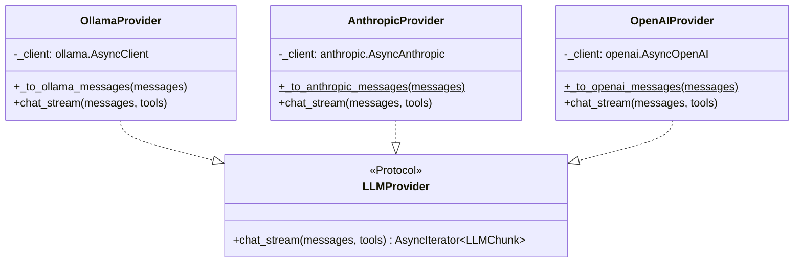

### Side-by-side translation table

| Concern | Ollama | Anthropic | OpenAI |
|---|---|---|---|
| Tool spec shape | `{"type":"function","function":{...}}` | `{"name","description","input_schema"}` | Same as Ollama |
| System prompt | First message with `role="system"` | Separate `system=` kwarg (not in the messages list) | First message with `role="system"` |
| Assistant w/ tool_use | `{"role":"assistant","content":"...","tool_calls":[...]}` | `{"role":"assistant","content":[{"type":"text",...},{"type":"tool_use","id",...}]}` | `{"role":"assistant","content":"...","tool_calls":[{"id","type":"function","function":{"name","arguments":<json string>}}]}` |
| Tool result | `{"role":"tool","content":"..."}` (no id) | One **user** message with `[{"type":"tool_result","tool_use_id",...}, ...]` per call (consecutive results fold into a single user turn) | `{"role":"tool","tool_call_id":"...","content":"..."}` |
| Tool-call id | Synthesized `tc_0`, `tc_1` (Ollama has no native ids) | Server-generated `toolu_...` | Server-generated `call_...` |
| Tool-call args | Streamed complete in one chunk's `message.tool_calls` (typically the final chunk) | `input_json_delta` fragments accumulated per content-block `index`, parsed at `content_block_stop` | Per-`index` JSON string fragments under `delta.tool_calls[].function.arguments`, concatenated then parsed at end of stream |
| Usage on stream | Final chunk's `prompt_eval_count` / `eval_count` / `eval_duration` | `message_start` → `input_tokens`; `message_delta` → `output_tokens` | Trailing chunk with `choices=[]` carrying `usage` (requires `stream_options={"include_usage": True}`) |
| `duration_ns` source | Real decode time from Ollama | Wall-clock around the stream (approximate) | Wall-clock around the stream (approximate) |
| Required extras | None (uses `options={...}` from `Settings`) | `max_tokens` is required by the API | `stream_options={"include_usage": True}` |

### Stream-event handling (per adapter)

**Ollama** ([ollama.py](../../backend/app/llm/ollama.py))

```
for chunk in client.chat(stream=True, ...):
    if chunk.message.content: yield LLMChunk(delta_text=...)
    if chunk.message.tool_calls: remember as final list
    if chunk.done: yield LLMChunk(done=True, tool_calls=final, usage=from chunk)
```

**Anthropic** ([anthropic.py](../../backend/app/llm/anthropic.py))

| Event | Adapter action |
|---|---|
| `message_start` | Capture `usage.input_tokens` |
| `content_block_start` (type=`tool_use`) | Allocate a buffer keyed by `event.index` with id+name |
| `content_block_delta` (`text_delta`) | `yield LLMChunk(delta_text=delta.text)` immediately |
| `content_block_delta` (`input_json_delta`) | Append `delta.partial_json` to the buffer at `event.index` |
| `content_block_stop` | Parse buffered JSON, push `LLMToolCall` onto `completed[]` |
| `message_delta` | Capture `usage.output_tokens` |
| (stream ends) | `yield LLMChunk(done=True, tool_calls=completed, usage=...)` |

**OpenAI** ([openai.py](../../backend/app/llm/openai.py))

| Chunk shape | Adapter action |
|---|---|
| `choices[0].delta.content` non-empty | `yield LLMChunk(delta_text=...)` |
| `choices[0].delta.tool_calls[i]` with `id`/`name` | Initialise per-`index` buffer |
| `choices[0].delta.tool_calls[i]` with `function.arguments` fragment | Append fragment to that buffer |
| `chunk.usage` non-None (trailing `choices=[]` chunk) | Capture `prompt_tokens` / `completion_tokens` |
| (stream ends) | Parse each buffer's JSON, `yield LLMChunk(done=True, tool_calls=all_buffers, usage=...)` |

### Sequence diagram — tool turn under Anthropic

```mermaid
sequenceDiagram
    autonumber
    participant Loop as run_turn()
    participant Adapter as AnthropicProvider
    participant SDK as anthropic SDK
    participant API as api.anthropic.com

    Loop->>Adapter: chat_stream(messages, tools)
    Adapter->>Adapter: _to_anthropic_messages()<br/>(pull system, build content blocks,<br/>fold consecutive tool messages)
    Adapter->>SDK: messages.create(stream=True, ...)
    SDK->>API: HTTPS request
    API-->>SDK: SSE event stream
    loop streaming
        SDK-->>Adapter: RawMessageStartEvent (usage.input_tokens)
        SDK-->>Adapter: RawContentBlockStartEvent (tool_use, id, name)
        Note over Adapter: alloc buffer[index]
        SDK-->>Adapter: RawContentBlockDeltaEvent (input_json_delta "...")
        Note over Adapter: append to buffer
        SDK-->>Adapter: RawContentBlockDeltaEvent (input_json_delta "...")
        SDK-->>Adapter: RawContentBlockStopEvent
        Note over Adapter: parse JSON, push LLMToolCall
        SDK-->>Adapter: RawMessageDeltaEvent (usage.output_tokens)
        SDK-->>Adapter: RawMessageStopEvent
    end
    Adapter-->>Loop: LLMChunk(done=True,<br/>tool_calls=[...], usage=...)
```

### Factory and lazy imports

```python
def get_provider() -> LLMProvider:
    s = get_settings()
    match s.llm_provider:
        case "ollama":    from .ollama    import OllamaProvider;    return OllamaProvider(s)
        case "anthropic": from .anthropic import AnthropicProvider; return AnthropicProvider(s)
        case "openai":    from .openai    import OpenAIProvider;    return OpenAIProvider(s)
```

Each adapter's `__init__` reads its own subset of `Settings`. Anthropic and OpenAI adapters raise `RuntimeError` if the corresponding API key is empty so the failure mode is loud, at process start, not on the first chat turn.

### Open questions / regression surface

- **Anthropic conversation invariants.** Empty text blocks are rejected; consecutive `tool_result` blocks must fold into one user turn; `user` / `assistant` must alternate. The adapter handles the obvious cases but exotic shapes (e.g. assistant turn 1 with tool_use, turn 2 with text only and no tools) may surface 400s.
- **Cloud `duration_ns` is wall-clock.** The per-turn tokens/sec figure is therefore not directly comparable across providers — fine for now, would matter for a comparison view.
- **JSON-fragment robustness.** Both cloud adapters fall back to `arguments = {}` on `json.JSONDecodeError`. The model's tool call will then likely fail with an "argument error", which the loop feeds back so the model can self-correct. We've not seen this happen in practice; if it becomes common, the right fix is to surface the raw partial JSON in the error message.

---

## 8. Tools and sandbox

**Files**: [tools/read_file.py](../../backend/app/tools/read_file.py), [tools/write_file.py](../../backend/app/tools/write_file.py), [tools/list_files.py](../../backend/app/tools/list_files.py), [tools/web_search.py](../../backend/app/tools/web_search.py), [tools/fetch_url.py](../../backend/app/tools/fetch_url.py), [tools/_sandbox.py](../../backend/app/tools/_sandbox.py)

### `read_file` ([read_file.py](../../backend/app/tools/read_file.py))

| Aspect | Value |
|---|---|
| Schema params | `{"path": str}`, required |
| Approval | No |
| Returns | UTF-8 text of the file (errors-replace) |
| Truncation | At `MAX_BYTES = 64_000` (~16k tokens at 4 chars/token), with a footer noting the original size |
| Errors | `SandboxError` (path escapes), `FileNotFoundError`, `IsADirectoryError` — all surface as `(ok=False, …)` to the loop |
| Async | Reads via `asyncio.to_thread(p.read_bytes)` so the event loop isn't blocked |

### `write_file` ([write_file.py](../../backend/app/tools/write_file.py))

| Aspect | Value |
|---|---|
| Schema params | `{"path": str, "content": str}`, both required |
| Approval | **Yes** (`requires_approval=True`) |
| Returns | `"wrote N chars to <path>"` |
| Behaviour | Creates parent directories; **overwrites** existing files |
| Errors | `SandboxError`; `OSError` from the underlying write |
| Async | Writes via `asyncio.to_thread(p.write_text, content, "utf-8")` |

### `web_search` ([web_search.py](../../backend/app/tools/web_search.py))

| Aspect | Value |
|---|---|
| Schema params | `{"query": str}`, required |
| Approval | No (read-only) |
| Returns | Numbered list (1..5) of `title / url / snippet` blocks, prefixed with `"Search results for '<query>':"` |
| Backend | `ddgs` library — DDG via [`primp`](https://pypi.org/project/primp/), a Rust HTTP client with browser-grade TLS fingerprinting. See [ADR 0005](../decisions/0005-search-backend-ddgs.md) for why we don't scrape the HTML endpoint directly |
| Result count | Fixed at `MAX_RESULTS = 5` — not exposed to the model |
| Errors | Library exceptions surface as `(ok=False, …)` to the loop; common case is empty results, which return `"No results for '<query>'."` (still `ok=True`) |
| Async | `ddgs.text` is sync; we wrap in `asyncio.to_thread` so the event loop keeps moving |

### `_sandbox.safe_path()` ([_sandbox.py:23](../../backend/app/tools/_sandbox.py#L23))

The single boundary check shared by every file tool.

```mermaid
flowchart TB
    in(["user_path: str"]) --> empty{empty or<br/>whitespace-padded?}
    empty -- yes --> err1[/SandboxError/]
    empty -- no --> resolve["target = (root / user_path).resolve()"]
    resolve --> contains{target.is_relative_to(root)?}
    contains -- no --> err2[/SandboxError: escapes sandbox/]
    contains -- yes --> ok(["return target: Path"])
```

Why `Path.resolve()` first: it collapses `..` and follows symlinks, so the containment check operates on the *real* final path. `Path.is_relative_to()` is the canonical containment predicate on Python 3.9+.

**What's caught**:
- `../../etc/passwd` (relative escape) → resolves outside root → rejected
- `/etc/passwd` (absolute) → resolves to itself → not under sandbox root → rejected
- `link-to-outside` (symlink to outside) → resolves to target → rejected
- Whitespace-padded `" foo.txt "` → rejected as ill-formed

**What's not caught** (out of scope per ADR 0003 §5):
- A model that spawns a subprocess from `python_exec` (Phase 2 second session — relies on `subprocess + rlimits`, not `safe_path`)
- TOCTOU races between resolve-time and use-time
- A determined adversary controlling the model

---

## 9. Memory — short-term ring buffer

**File**: [backend/app/memory/buffer.py](../../backend/app/memory/buffer.py) · **ADR**: [0001](../decisions/0001-tech-stack.md)

40 lines. Per-conversation `deque(maxlen=32)`, keyed in a dict. No persistence — Phase 3 introduces SQLite for long-term memory ([§14 below](#14-phase-3-long-term-memory-planned)).

### API

```python
buffer.append(cid, Message(role="user", content="..."))
buffer.append(cid, Message(role="assistant", content="..."))
history: list[Message] = buffer.history(cid)
buffer.clear(cid)
```

### Retention

Per-conversation, last **32 messages** total. With user/assistant alternation that's ~16 round-trips before old context starts dropping. With tools the *user-visible* turn count is preserved (we only persist user + final assistant), but the history seen by Ollama within a single tool-using turn can include many `tool` messages — those are intra-turn and never hit the buffer.

### Lifetime

Module-level singleton `buffer = ConversationBuffer()` ([buffer.py:40](../../backend/app/memory/buffer.py#L40)). Lives as long as the uvicorn process. **Restarts wipe it.** This is intentional for Phase 1/2; Phase 3 adds the SQLite backing.

---

## 10. Prompt assembly

**File**: [backend/app/agent/prompt.py](../../backend/app/agent/prompt.py)

```python
SOUL_PATH = Path(__file__).resolve().parents[3] / "SOUL.md"

def system_prompt() -> str:
    return SOUL_PATH.read_text(encoding="utf-8").strip()
```

Two design choices worth knowing:

- **It's a function, not a constant**, so [SOUL.md](../../SOUL.md) is re-read on every turn. Persona edits are hot.
- The path math is `parents[3]`: `prompt.py` → `agent/` → `app/` → `backend/` → repo root. If the file moves, this number changes.

The cost is one small file read per turn (negligible). The benefit is rapid iteration on the assistant's voice without restarting the server.

---

## 11. Configuration

**File**: [backend/app/config.py](../../backend/app/config.py)

`pydantic-settings`-based. Values come from process env vars (prefixed `PA_`) or a `.env` at the repo root. Singleton via `@lru_cache get_settings()`. Read-once at startup.

### LLM backend selection ([ADR 0007](../decisions/0007-llm-provider-abstraction.md))

| Setting (Python) | Env var | Default | Used by |
|---|---|---|---|
| `llm_provider` | `PA_LLM_PROVIDER` | `ollama` | `llm.get_provider()` — chooses adapter class |

### Ollama (active when `llm_provider="ollama"`)

| Setting (Python) | Env var | Default | Used by |
|---|---|---|---|
| `ollama_host` | `PA_OLLAMA_HOST` | `http://localhost:11434` | `OllamaProvider`, `/health` |
| `ollama_model` | `PA_OLLAMA_MODEL` | `qwen3.5:4b` | `OllamaProvider` |
| `ollama_think` | `PA_OLLAMA_THINK` | `false` | `OllamaProvider` (Qwen3's reasoning mode) |
| `ollama_device` | `PA_OLLAMA_DEVICE` | `auto` | `config.ollama_options()` — read by `OllamaProvider` |
| `ollama_num_ctx` | `PA_OLLAMA_NUM_CTX` | `32768` | `config.ollama_options()` |
| `request_timeout_s` | `PA_REQUEST_TIMEOUT_S` | `60.0` | Per-chunk idle timeout on the Ollama HTTP stream |

### Anthropic (active when `llm_provider="anthropic"`)

| Setting (Python) | Env var | Default | Used by |
|---|---|---|---|
| `anthropic_api_key` | `PA_ANTHROPIC_API_KEY` | `""` (required) | `AnthropicProvider.__init__` — raises if empty |
| `anthropic_model` | `PA_ANTHROPIC_MODEL` | `claude-haiku-4-5` | `AnthropicProvider` |
| `anthropic_max_tokens` | `PA_ANTHROPIC_MAX_TOKENS` | `4096` | `AnthropicProvider` — required by the Messages API |

### OpenAI (active when `llm_provider="openai"`)

| Setting (Python) | Env var | Default | Used by |
|---|---|---|---|
| `openai_api_key` | `PA_OPENAI_API_KEY` | `""` (required) | `OpenAIProvider.__init__` — raises if empty |
| `openai_model` | `PA_OPENAI_MODEL` | `gpt-4o-mini` | `OpenAIProvider` |

### Agent loop + logging

| Setting (Python) | Env var | Default | Used by |
|---|---|---|---|
| `agent_sandbox` | `PA_AGENT_SANDBOX` | `sandbox` | `_sandbox.sandbox_root()` |
| `agent_max_steps` | `PA_AGENT_MAX_STEPS` | `8` | `loop.run_turn()` |
| `agent_max_retries_per_tool` | `PA_AGENT_MAX_RETRIES_PER_TOOL` | `2` | `loop.run_turn()` |
| `agent_auto_approve` | `PA_AGENT_AUTO_APPROVE` | `false` | `loop._dispatch_tool()` (skip approval) |
| `log_dir` | `PA_LOG_DIR` | `logs` | `logging_config` |
| `log_level` | `PA_LOG_LEVEL` | `INFO` | `logging_config` |

Type aliases:
- `Device = Literal["auto", "cpu", "gpu"]`
- `LLMProviderName = Literal["ollama", "anthropic", "openai"]`

---

## 12. Logging

**File**: [backend/app/logging_config.py](../../backend/app/logging_config.py) · **Called from**: [main.py:11](../../backend/app/main.py#L11)

`configure_logging()` runs at import time (before the FastAPI app object is constructed) so import-time messages are captured. It:

1. Resolves and creates `${PA_LOG_DIR}` if missing.
2. Builds a single `Formatter`: `"%(asctime)s %(levelname)-7s %(name)s: %(message)s"`.
3. Attaches a `TimedRotatingFileHandler` (`when="midnight"`, `backupCount=7`, local time) and a `StreamHandler` (stderr) to the **root logger**.
4. Sets the root level from `PA_LOG_LEVEL`.
5. **Reroutes** uvicorn's loggers (`uvicorn`, `uvicorn.access`, `uvicorn.error`) by clearing their handlers and setting `propagate = True`, so HTTP traffic lands in the same file.

### Logger names

| Name | Used in | What it logs |
|---|---|---|
| `pa.main` | [main.py](../../backend/app/main.py) | Startup banner |
| `pa.chat` | [api/chat.py](../../backend/app/api/chat.py) | Endpoint entry/exit, latency, ws connect/disconnect, bad-request warnings |
| `pa.agent` | [agent/loop.py](../../backend/app/agent/loop.py) | Per-step iteration, tool failures, final reply length |
| `uvicorn*` | (rerouted) | HTTP access + errors |

Daily rotation produces `pa.log`, `pa.log.YYYY-MM-DD`, …; the oldest is dropped after 7 backups.

---

## 13. Frontend

**File**: [frontend/src/App.tsx](../../frontend/src/App.tsx) · **Build**: [vite.config.ts](../../frontend/vite.config.ts) · **Lessons**: [docs/learnings/frontend.md](../learnings/frontend.md)

A single-file React app — chat UI, WS client, frame reducer, and the `ToolCard` subcomponent.

### State shape

| Variable | Type | Purpose |
|---|---|---|
| `transcript` | `TranscriptItem[]` | Ordered list of messages and tool cards |
| `input` | `string` | Composer textarea |
| `busy` | `boolean` | A turn is in flight (disables composer + New) |
| `error` | `string \| null` | Last error message banner |
| `conn` | `'connecting' \| 'open' \| 'closed'` | WS connection state, shown as a status dot |
| `conversationId` | `string` | Client-generated id (`"c-" + UUID`); stable until "New" is pressed |
| `wsRef` | `RefObject<WebSocket \| null>` | Live socket handle; ref because mutating it shouldn't re-render |
| `scrollerRef` | `RefObject<HTMLDivElement \| null>` | Messages container, used to auto-scroll on transcript change |

### `TranscriptItem` (discriminated union)

```ts
type TranscriptItem =
  | { kind: 'message'; id, role: 'user'|'assistant'; content }
  | { kind: 'tool'; id, call_id, name, args, awaitingApproval; result?: { ok, preview } }
```

Tool cards are interleaved into the transcript so they appear inline at the right moment.

### Frame reducer

[`handleFrame()`](../../frontend/src/App.tsx#L126) is a switch on `frame.type`. All `setTranscript` calls use the **callback form** (`prev => ...`) so fast-arriving token frames compose correctly.

| Frame `type` | Reducer action | Notes |
|---|---|---|
| `token` | If last item is an assistant message → append `delta`; else push a new assistant message | Streaming append uses `last.content + frame.delta` |
| `tool_call` | Upsert a tool card by `call_id` | Card created on first sight of this `call_id` |
| `tool_approval` | Upsert + set `awaitingApproval: true` | Renders Approve / Deny buttons on the card |
| `tool_result` | Find by `call_id`, set `result` and clear `awaitingApproval` | The card ends in `ok` or `error` styling |
| `done` | Set `busy: false` | Composer re-enabled |
| `error` | Set `error`, `busy: false` | Banner shown above the composer |

[`upsertTool()`](../../frontend/src/App.tsx#L178) handles the "tool_approval might arrive before tool_call" race by creating-or-patching by `call_id`.

### WebSocket lifecycle

Single connection opened in a `useEffect` with `[]` deps ([App.tsx:99-124](../../frontend/src/App.tsx#L99-L124)). Cleanup closes the socket. `onopen`/`onerror`/`onclose` handlers all check `wsRef.current === ws` to **guard against React StrictMode double-mounts** in dev, which would otherwise have stale handlers from the first mount fire on the second mount's socket.

### Component tree

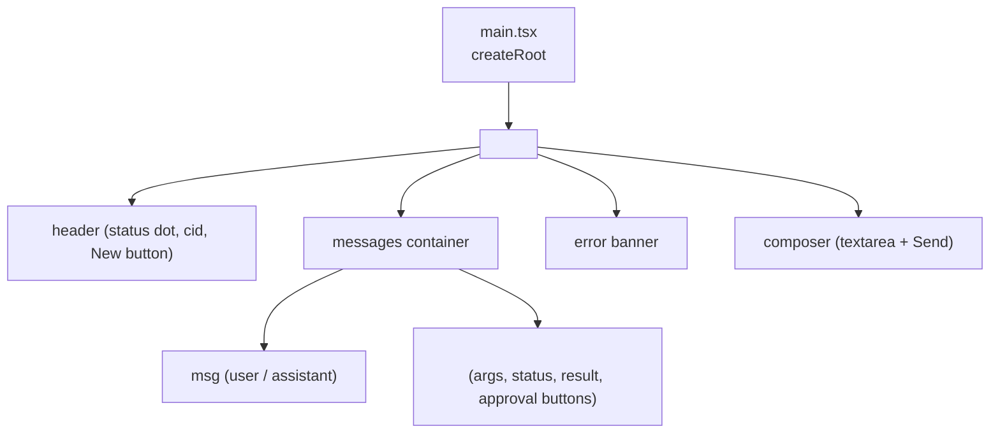

### "New chat" flow

`newChat()` ([App.tsx:247](../../frontend/src/App.tsx#L247)) rotates `conversationId` (so the next message starts a fresh history on the server) and best-effort `POST /chat/reset` to evict the old conversation from the buffer. The fetch is fire-and-forget; the rotated id alone is enough.

### Dev proxy and LAN access

[vite.config.ts](../../frontend/vite.config.ts) proxies `/chat` (with `ws: true`) and `/health` to `:8000` so the browser sees same-origin requests in dev. `wsUrl()` builds the WS URL from `window.location` so connecting from a phone on the LAN (`http://<laptop-ip>:5173`) "just works." WSL2-specific networking notes (mirrored mode, firewall rules) are in [docs/learnings/frontend.md](../learnings/frontend.md).

---

## 14. Phase 3 — long-term memory (planned)

> All planned-phase sections below are **design intent**, not implemented behaviour. They will get LLD entries equal in detail once the code exists.

### Goal

Persist facts across restarts and across conversations. On each turn, retrieve the top-k most-relevant facts and prepend them to the system message.

### Components to add

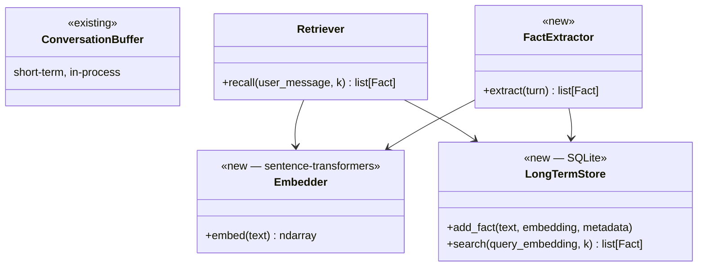

### Storage sketch

A single SQLite file under `${PA_DATA_DIR}` (new env var). One table for facts:

```sql
CREATE TABLE facts (
    id INTEGER PRIMARY KEY,
    text TEXT NOT NULL,
    embedding BLOB NOT NULL,        -- packed float32
    created_at TEXT NOT NULL,
    source TEXT,                    -- e.g. "cid:c-abc:turn:7"
    weight REAL DEFAULT 1.0
);
```

Embeddings are 384-dim (`all-MiniLM-L6-v2`), stored as packed `float32` BLOB. Top-k is brute-force cosine similarity in Python — adequate for thousands of facts, swap to a vector index later if needed.

### Retrieval flow (where it slots in)

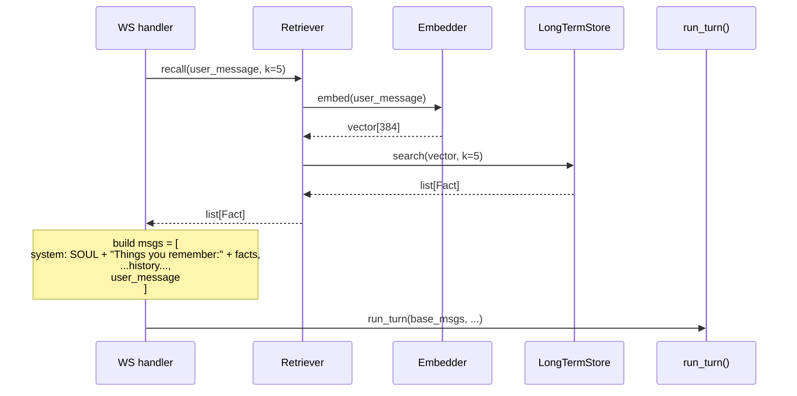

### Fact extraction

Either an in-loop step (the agent itself emits facts via a `remember(text)` tool) or a post-turn pass (a small classifier scans the turn for declarative statements). Lean toward the tool approach — it's simpler and lets the user see what's being remembered (could even be approval-gated).

### Open questions for Phase 3

- Where does retrieval happen relative to streaming? (Probably: synchronously before the first stream call — adds a few hundred ms but happens once per turn.)
- How does "forget X" work — soft-delete with `weight = 0`, hard-delete, or a `forgotten` flag?
- Do we re-embed on model swap, or pin to one embedding model permanently?

---

## 15. Phase 4 — voice I/O (planned)

### Topology

A **separate worker process** for the audio models (faster-whisper, Piper) so model loading and inference don't block the FastAPI event loop. The worker talks to FastAPI over a Unix socket or an in-process queue.

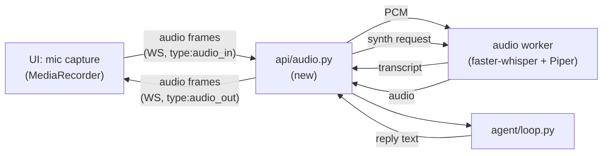

### New frame types

| `type` | Direction | Fields |
|---|---|---|
| `audio_in` | C → S | `chunk: base64`, `sample_rate`, `format` |
| `audio_in_end` | C → S | (signals end of utterance) |
| `transcript` | S → C | `text`, `final: bool` (interim transcripts during streaming ASR) |
| `audio_out` | S → C | `chunk: base64`, `sample_rate`, `format` |

Existing `token`, `tool_*`, `done`, `error` frames are unchanged.

### Open questions for Phase 4

- Push-to-talk vs VAD-driven? Start with PTT for simplicity.
- Streaming ASR (interim transcripts) vs batch (one final transcript)? faster-whisper supports both.
- TTS at sentence boundaries vs at the end of the turn? Sentence-level is much better UX but needs a sentence boundary detector that doesn't break on partial tokens.

---

## 16. Phase 5 — calendar tools (planned)

No structural change. Adds tool entries to `TOOLS`:

| Tool | Approval | Notes |
|---|---|---|
| `calendar_list_events(start, end)` | No | Read-only |
| `calendar_create_event(title, start, end, …)` | **Yes** | Default approval-gated |
| `calendar_modify_event(id, …)` | **Yes** | |
| `calendar_delete_event(id)` | **Yes** | |

A small `backend/app/integrations/calendar.py` holds the auth handshake and a credentials cache. Likely Google Calendar via OAuth, or CalDAV for self-hosted setups.

---

## 17. Phase 6 — hot paths (planned)

Profile after Phase 4 lands. Likely candidates for FFI replacement:

| Hot spot | Why hot | FFI shape |
|---|---|---|
| Embedder tokenisation / normalisation | Called on every turn (retrieval) and every fact extraction | `cffi` shim around a small C tokeniser |
| Cosine similarity over many facts | Scales linearly with fact count; pure-Python is fine to ~10k facts then degrades | `pybind11` wrapper around a SIMD-aware impl |
| `safe_path` boundary check | Only if it shows up in profiling — probably won't | n/a |

The pattern: pure-Python implementation stays as the fallback; the FFI version is loaded if available. Tests pin the contract on both.

---

## 18. Phase 7 — mobile (planned)

Open question; revisit when the rest is solid. The three options and what each implies architecturally:

| Option | Architecture impact |
|---|---|
| **React Native** | Reuse most of the React component layer; backend stays on the laptop, phone is a thin client over the LAN. Lowest backend churn. |
| **Native Android** | Best UX, biggest rewrite (Kotlin/Compose). Backend stays separate; phone talks the existing WS protocol. |
| **PWA** | Fastest path; works in any phone browser today. Limits voice (no mic permission backgrounded), no proper background tasks. |

The decision affects whether the backend remains "always-on at home, phone talks to it" or whether parts of the stack move on-device. Out of scope until everything else ships.

---

## Appendix — file index

| Path | Lines | Role |
|---|---|---|
| [backend/app/main.py](../../backend/app/main.py) | ~42 | FastAPI app, CORS, `/health`, router mount |
| [backend/app/api/chat.py](../../backend/app/api/chat.py) | ~215 | HTTP + WS endpoints, frame protocol |
| [backend/app/agent/loop.py](../../backend/app/agent/loop.py) | ~235 | `run_turn()`, `_dispatch_tool()` (provider-agnostic) |
| [backend/app/agent/prompt.py](../../backend/app/agent/prompt.py) | ~10 | `system_prompt()` (SOUL.md hot-loader) |
| [backend/app/llm/__init__.py](../../backend/app/llm/__init__.py) | ~46 | `get_provider()` factory + public type re-exports |
| [backend/app/llm/base.py](../../backend/app/llm/base.py) | ~73 | `LLMProvider` Protocol, `LLMMessage`, `LLMChunk`, `LLMToolCall`, `LLMUsage` |
| [backend/app/llm/ollama.py](../../backend/app/llm/ollama.py) | ~105 | `OllamaProvider` — wraps `ollama.AsyncClient` |
| [backend/app/llm/anthropic.py](../../backend/app/llm/anthropic.py) | ~185 | `AnthropicProvider` — content-block tool protocol, system pull-out |
| [backend/app/llm/openai.py](../../backend/app/llm/openai.py) | ~145 | `OpenAIProvider` — indexed tool-call fragment assembly |
| [backend/app/tools/registry.py](../../backend/app/tools/registry.py) | ~90 | `Tool` dataclass, `TOOLS`, three per-provider formatters |
| [backend/app/tools/read_file.py](../../backend/app/tools/read_file.py) | ~37 | read tool + `NAME` / `DESCRIPTION` / `PARAMETERS` |
| [backend/app/tools/write_file.py](../../backend/app/tools/write_file.py) | ~32 | write tool + `NAME` / `DESCRIPTION` / `PARAMETERS` |
| [backend/app/tools/list_files.py](../../backend/app/tools/list_files.py) | ~87 | sandbox directory listing |
| [backend/app/tools/web_search.py](../../backend/app/tools/web_search.py) | ~66 | DDG search via `ddgs` library |
| [backend/app/tools/fetch_url.py](../../backend/app/tools/fetch_url.py) | ~145 | URL fetch + main-content extraction (approval-gated, public hosts only) |
| [backend/app/tools/_sandbox.py](../../backend/app/tools/_sandbox.py) | ~37 | `safe_path()`, `sandbox_root()`, `SandboxError` |
| [backend/app/memory/buffer.py](../../backend/app/memory/buffer.py) | ~41 | `Message`, `ConversationBuffer`, `buffer` singleton |
| [backend/app/config.py](../../backend/app/config.py) | ~70 | `Settings`, `get_settings()`, `ollama_options()` |
| [backend/app/logging_config.py](../../backend/app/logging_config.py) | ~57 | `configure_logging()` |
| [backend/tests/test_agent_loop.py](../../backend/tests/test_agent_loop.py) | ~470 | Loop unit tests via `FakeProvider` |
| [backend/tests/test_provider_ollama.py](../../backend/tests/test_provider_ollama.py) | ~165 | OllamaProvider chunk translation |
| [backend/tests/test_provider_anthropic.py](../../backend/tests/test_provider_anthropic.py) | ~270 | AnthropicProvider message + event translation |
| [backend/tests/test_provider_openai.py](../../backend/tests/test_provider_openai.py) | ~220 | OpenAIProvider fragment assembly |
| [frontend/src/App.tsx](../../frontend/src/App.tsx) | ~375 | UI, WS client, frame reducer, `ToolCard` |
| [frontend/vite.config.ts](../../frontend/vite.config.ts) | — | Dev proxy for `/chat` (ws) and `/health` |
| [scripts/smoke_*.py](../../scripts/) | — | End-to-end test drivers (`smoke_provider.py` is provider-agnostic) |
